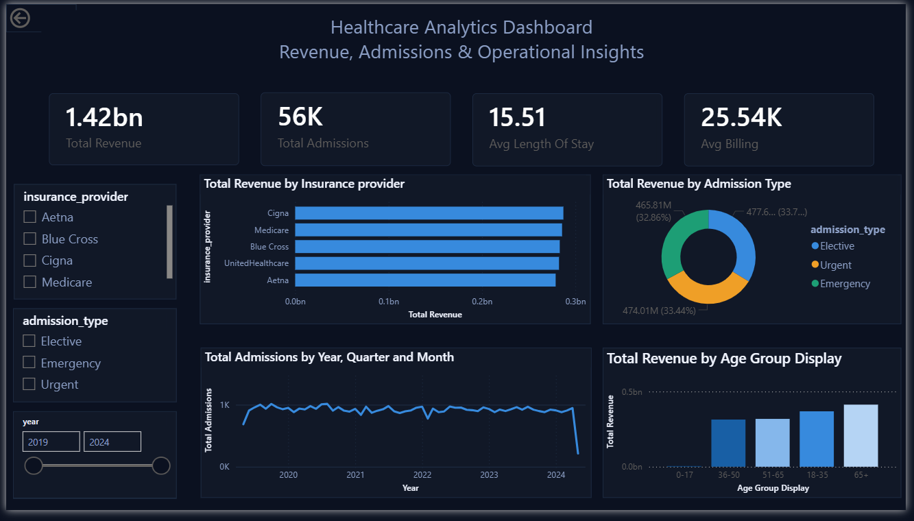
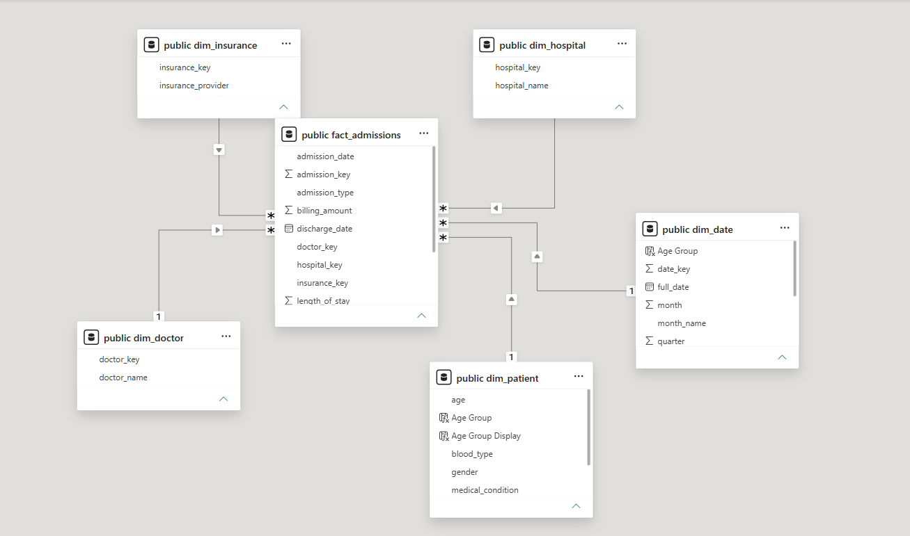

# 🏥 Healthcare Revenue & Operations Analytics Dashboard

## Overview

An end-to-end healthcare analytics solution built using PostgreSQL (Supabase), SQL, DAX, and Power BI to analyze 55,500+ healthcare admission records.

---

## Technology Stack

- Power BI
- PostgreSQL (Supabase)
- SQL
- DAX
- Data Modeling
- Business Intelligence

---

## Dashboard Preview

## Data Model

## KPI View

---

## Key Metrics

- Total Revenue: $1.42B
- Total Admissions: 56K+
- Average Length of Stay: 15.51 Days
- Average Billing: $25.54K

---

## Dashboard Features

- Revenue by Insurance Provider
- Revenue by Admission Type
- Revenue by Age Group
- Admissions Trend Analysis
- Interactive Slicers
- Executive KPI Cards

---

## Star Schema

### Fact Table
- fact_admissions

### Dimension Tables
- dim_patient
- dim_doctor
- dim_hospital
- dim_insurance
- dim_date

---

## SQL Components

- healthcare_schema.sql
- healthcare_etl.sql
- analytics_queries.sql

---

## Skills Demonstrated

- SQL
- PostgreSQL
- Power BI
- DAX
- Data Warehousing
- Star Schema Modeling
- Dashboard Development
- Data Visualization

---

## Author

Aishwarya Brungi
